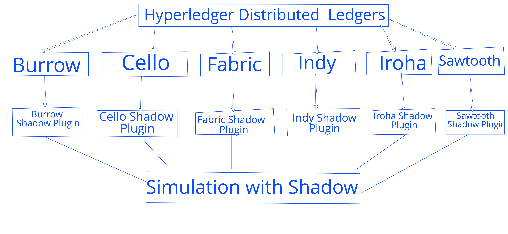

# shadow-hyperledger

.

[Shadow](https://shadow.github.io/) is a network simulation tool which is capable of
running off-the-shelf software in a controlled, simulated network environment. Shadow
requires a plugin to be written for each piece of software under simulation. This
repository is focused on adding Shadow plugin for each of [Hyperledger Blockchains](https://github.com/hyperledger).

You can find some more information about the project [here](https://wiki.hyperledger.org/internship/project_ideas).

You can find the installation instructions for Hyperledger blockchains inside
`installation instructions/<hyperledger-distributed-ledger-name>`.

You can find the current status of the research below:

|Hyperledger Distributed Ledgers| Status | Shadow Plugin | Instructions | Findings |
|:-----------------------------:|:------:|:-------------:|:------------:|:--------:|
|Burrow                         |        |<ul><li>- [ ] </li></ul>               |              |          |
|Cello                          |        |<ul><li>- [ ] </li></ul>              |              |          |
|Fabric                         |        |<ul><li>- [ ] </li></ul>               | [here](fabric.md )             |          |
|Indy                           |        |<ul><li>- [ ] </li></ul>               |              |          |
|Iroha                         |         |<ul><li>- [ ] </li></ul>    |  [here](iroha.md) |    |
|Quilt                          |        |<ul><li>- [ ] </li></ul>               |              |          |
|Sawtooth                       |        |<ul><li>- [ ] </li></ul>               |              |          |

|Shadow Simulation | Status  |Findings|
|:----------------:|:-------:|:------:|
|client/server tests written in Golang and Python | | threading system calls that Golang runtime rely on, Fabric and Sawtooth can't be simulated |
|client/server tests written in Rust| | `pthread_mutex_attr` API and a few other synchronization mechanisms, Indy can't be simulated |
| Iroha | Shadow Plugin to be built | |

Currently all Hyperledger Blockchain flavors and Shadow are added as git submodules
which will be patched to be run under Shadow.
